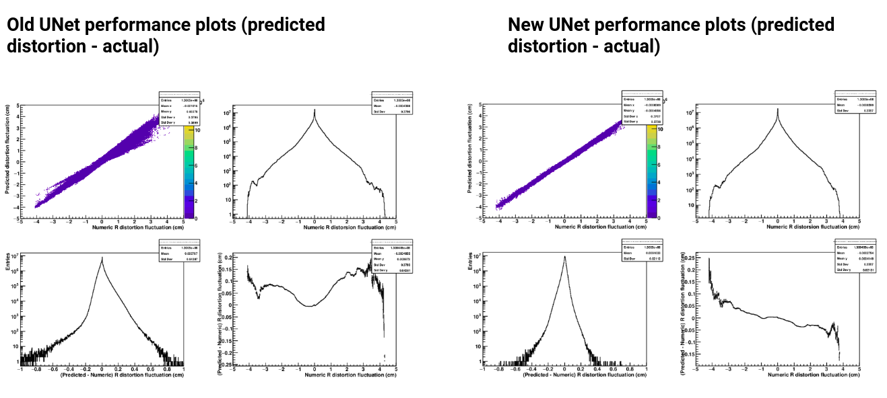

The [Time Projection Chamber](http://aliceinfo.cern.ch/Public/en/Chapter2/Chap2_TPC.html)(TPC) is a particle detector used by the ALICE experiment at CERN. Due to a phenomenon known as "ion backflow" the electric field lines that guide the particle tracks inside the TPC get shifted/distorted. To correct these distortions, a data-driven strategy is employed. Particularly a 3D Convolutional Network (UNet) is used to map the effect of space charge density maps into distortion corrections. My contribution were mainly geared towards improving the performance of the UNet model, particularly with respect to minimizng the difference between the predicted and actual distortions:
* I modified the architecture of the vanilla UNet model by implementing a parallel dilated convolution module, which used inflated kernels to preserve both spatial and semantic information throughout the encoder-decoder path of the network. 
* I also introduced residual connections to help the new deeper network to converge.
* The old model was undertrained and performed relatively poorly in cases where the distortion fluctuations were large. The new model remedies these problems to a large degree, producing significantly better plots and a much sharper correlation when the input maps are set to size 90x17x17. Network architecture studies are currently ongoing for input maps with finer granularity e.g. 180x33x33.
* I also developed a validation strategy for comparing models in tensorboard: through empirical analysis it was determined that root mean squared error was the best loss function, while other metrics like mean squared error, mean absolute error & mean absolute percentage error should all be simulatenously evaluated on the validation set and tracked through tensorboard. 
* I used this strategy to study the scalability of the old model: as a function of the number of training events and training epochs. The results were presented to CERN in an internal group meeting.   

For more details, check out the project on Github [here](https://github.com/harisriaz17/TPCwithDNN/tree/ResDUNet).