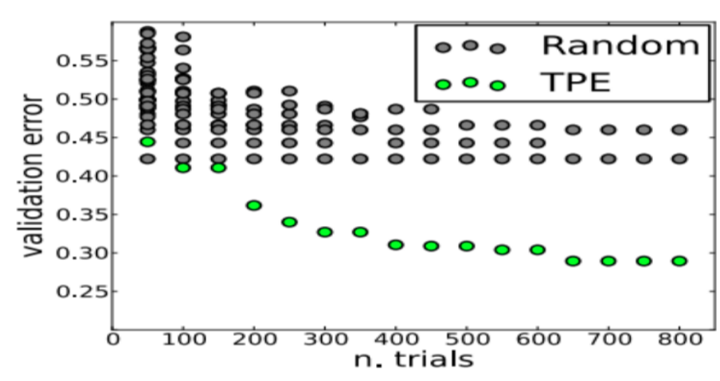

We gave an overview of my work on tuning the hyperparameters of machine learning models through Bayesian search. I briefly presented theoretical concepts of how the technique worked and the Tree Parzen Estimator (TPE) algorithm used. We higlighted the advantages of using Bayesian search instead of random and grid searches. We also gave a tutorial on how we implemented the bayesian search module in the [MachineLearningHEP](https://github.com/ginnocen/MachineLearningHEP) (MLHEP) software package used by CERN. A look at the pull request merging this functionality can be found [here](https://github.com/ginnocen/MachineLearningHEP/pull/629). The full tutorial can be found [here](https://docs.google.com/presentation/d/1d4XbpFXjaMwV-0R7Ue24L8p1zZ00YRITWnaC4RWO0nw/edit?usp=sharing). 

