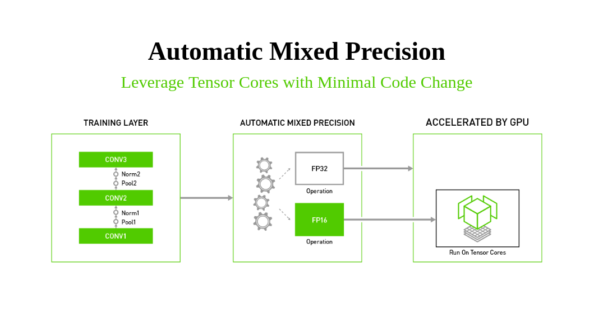

Gave a presentation/tutorial on leveraging GPU tensor cores for faster training and inference through mixed precision (FP16) in tensorflow. More details can be found [here.](https://docs.google.com/presentation/d/1caKpASatoSD6lEmT_15cNXXZXYkAub7BKEClH-UwhPY/edit?usp=sharing)
