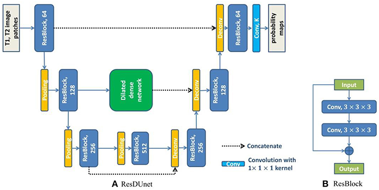

Proposed a 3D Residual UNet with dilated convolutions for improving prediction results & discussed motivations and intuitions for switching to this new model. 
I also presented performance results on 90x17x17 fine-grained input map where the new model significantly outperfomed the old model when both were trained on 
the same number of events. More details can be found [here](https://docs.google.com/presentation/d/1a5nQyjSJ8ke2d6HUSqvCF_ugKXO_saHeYCbtq8uemE4/edit?usp=sharing). 