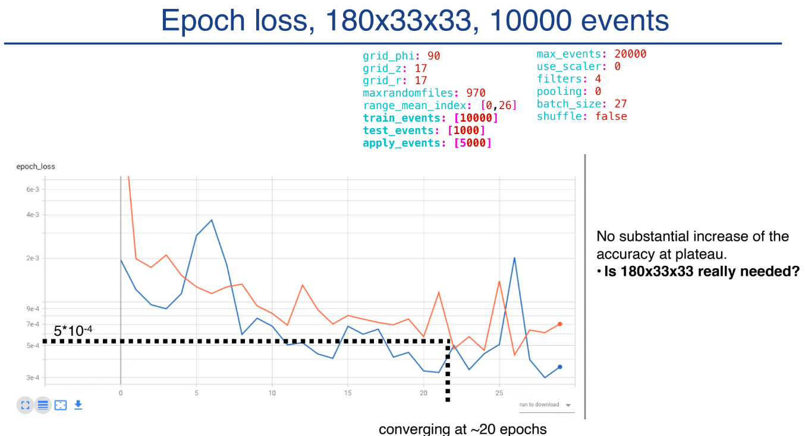

Internal report presented to members of the ALICE collaboration at CERN. We presented results from our tensorboard study of the model's performance as a function of the number of training events/samples and training iterations/epochs.  Also discussed a more effective validation strategy for evaluating different models.